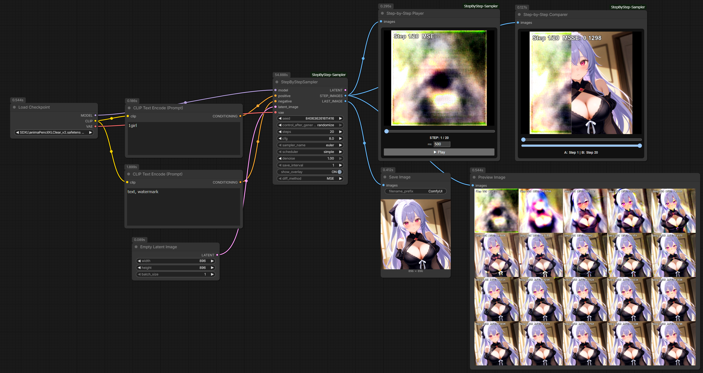
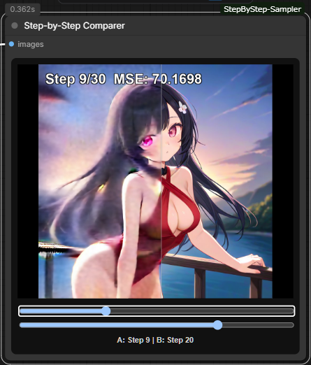

# ComfyUI-StepByStep-Sampler

A set of custom nodes for ComfyUI designed to analyze and compare the image generation process step-by-step. It quantifies changes in latent variables (using metrics like PSNR/SSIM) and provides a dedicated viewer for intuitive inspection. Furthermore, since sampling automatically stops once image generation converges, image generation can be performed with the optimal number of steps.

[](https://github.com/TakkunRed/ComfyUI-StepByStep-Sampler/blob/main/LICENSE)
[](https://github.com/comfyanonymous/ComfyUI)



## Node description

### 1. Step-by-Step Sampler
Hooks into the generation process to capture intermediate images at specified intervals by VAE encoding the latent state. It can be integrated with `Preview Image` or `Save Image` nodes to display or output the progression as a sequence.
Calculates the amount of change from the previous step using MSE, RMSE, L1, PSNR, or SSIM, allowing you to monitor convergence numerically.
Draws step counts and difference values directly onto the images, making it easy to track the step number and the delta from the preceding frame.
Since sampling automatically stops once image generation converges, image generation can be performed with the optimal number of steps.
Outputs the final result as a standard `LATENT` (similar to KSampler), but can also output the VAE-encoded image via the `LAST_IMAGE` socket.

### 2. Step-by-Step Player
Visualizes the image list output from the `STEP_IMAGES` socket of the `Step-by-Step Sampler`. Use the slider or the Play button to view the generation process as an animation.


### 3. Step-by-Step Comparer
A side-by-side visualization tool for the `STEP_IMAGES` output. It allows you to compare two different steps (e.g., Step 5 vs. Step 20) using an interactive split-screen slider.


## Installation
Manual Install
```
Bash
cd ComfyUI/custom_nodes
git clone https://github.com/TakkunRed/ComfyUI-StepByStep-Sampler.git
```
## How to Use
### Workflow Integration
* Add the Step-by-Step Sampler node.
* Connect `model`, `positive`, `negative`, `latent_image`, and `vae` to the respective inputs.
* Connect the `STEP_IMAGES` output to the `StepStepPlayer` or `StepStepComparer` node. You can also connect it to `Preview Image` or `Save Image`.
* Run Queue Prompt as usual, and the generation process will appear in the viewers.

### Viewer Controls
* `Player`: Change steps using the bottom slider or use the "Play" button for auto-playback.
* `Comparer`: Select two steps to compare using the sliders, and drag the vertical bar on the image to reveal the differences between side A and side B.

### Step-by-Step Sampler Settings
* `save_interval`: Determines how often images are saved (e.g., set to 1 to capture every step).
* `show_overlay`: Toggles the on-image display of step numbers and difference metrics.
* `diff_method`: Selects the algorithm for calculating step-to-step changes:
    * Metric Characteristics (at convergence):
        ```
        MSE → 0 (Emphasizes large changes)
        RMSE → 0 (MSE scaled back to L1 range)
        L1 → 0 (Simple, robust against outliers)
        PSNR → ∞ (Higher dB means closer to previous step; 40dB+ is a typical convergence target)
        SSIM → 1.0 (Structural Similarity Index; 0.99+ is a typical convergence target)
        ```
* `auto_stop`: Enable/Disable automatic convergence stop
* `stop_threshhold`: Threshold for determining convergence

## License
MIT